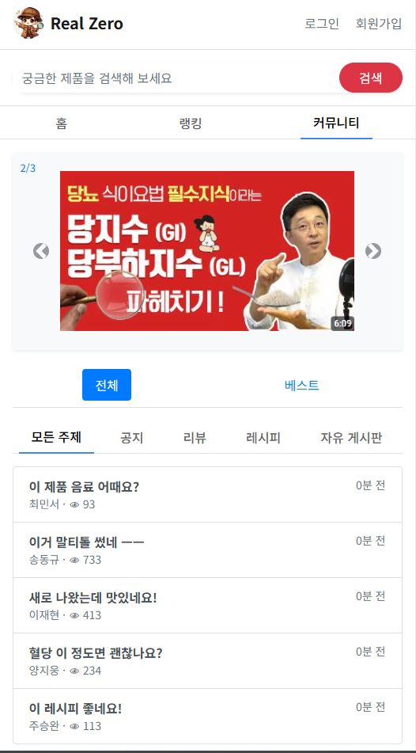
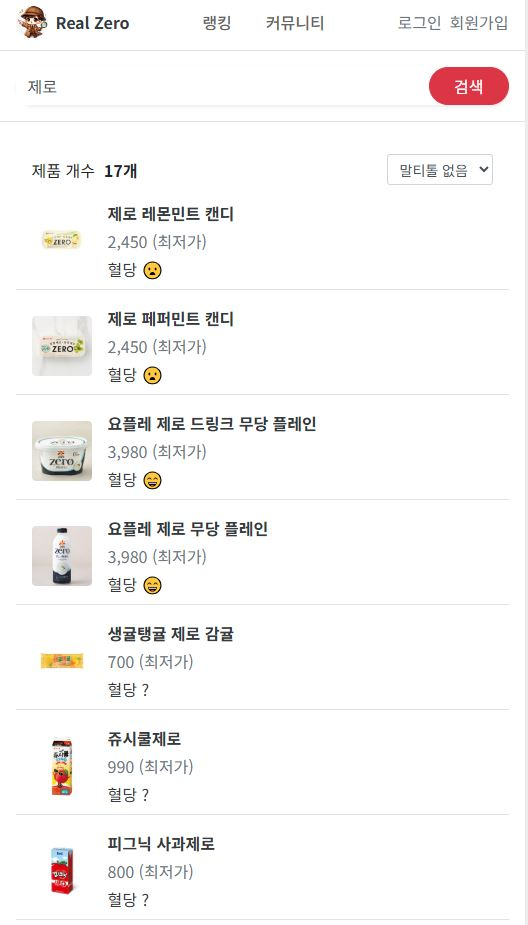
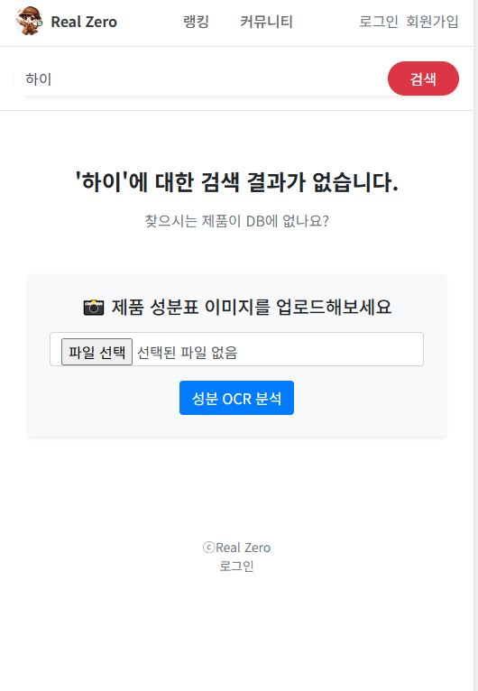
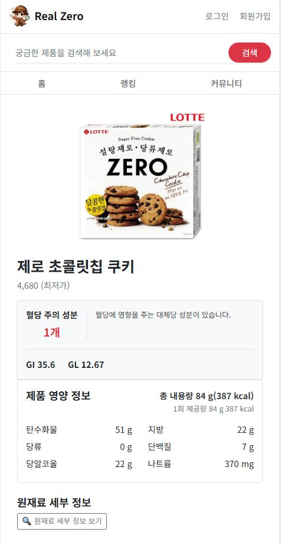
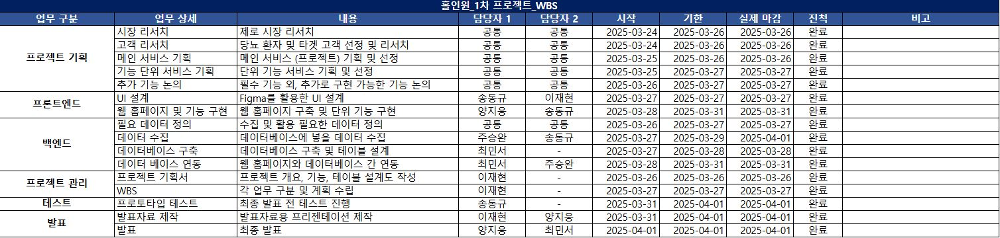

# real_zero
# fa05-1st-Hole_In_One
- KPMG Future Academy 5기 홀인원 팀 첫 번째 프로젝트입니다.

-------------------

# 프로젝트 기획서

## 1. 프로젝트 개요
- 프로젝트 주제 : **제로 식품의 영양성분과 혈당 영향도를 당뇨 환자들이 쉽고 간편하게 확인할 수 있는 웹서비스**
- 목표 : **웹 홈페이지를 통해 당뇨 환자들이 빠르고 간편하게, 정확하게 다양한 제로 식품들의 성분과 혈당 유의정보를 확인하여 건강 및 혈당 조절에 기여**
  
### 시각적 자료
- 홈

- 커뮤니티

- 검색 o

- 검색 x

- 세부정보 

## 2. 프로젝트 일정 (예시 Gantt 차트)

# 작업 분할 구조 (WBS)
- 프로젝트 수행을 위한 WBS 작성

## 1. 단계별 작업 구성
### 1. 기획
1.1. 문제 정의  

### 2. 데이터 수집 및 준비
2.1. 데이터 소스 조사  
2.2. 데이터 수집 및 저장  

### 3. 결과 도출 및 보고
4.1. 결과 요약  
4.2. 보고서 작성  

------------------------------

# 요구사항 정의서

## 1. 기능 요구사항
- [ ] 데이터 수집 기능: [수집 대상 및 방식]
- [ ] 데이터 전처리 기능: [결측치 처리, 이상치 제거 등]
- [ ] 분석 기능: [사용할 알고리즘 또는 분석 기법]
- [ ] 시각화 기능: [대시보드, 차트, 그래프]

## 2. 비기능 요구사항
- [ ] 시스템 안정성: 데이터 처리 시 오류 발생 최소화
- [ ] 성능: 데이터 처리 및 분석 시간 최소화
- [ ] 확장성: 새로운 데이터 추가 및 확장 가능

----------------------------

# 프로젝트 설계서

## 1. 시스템 아키텍처
- **구성 요소**:
  - 데이터 수집 모듈
  - 데이터 전처리 모듈
  - 데이터 분석 및 시각화 모듈

## 2. 데이터 설계
- **데이터 흐름**: 원천 데이터 → 전처리 → 분석 → 결과
- **주요 데이터 속성**:
  - 속성 이름: [예: user_id, timestamp, value]
  - 데이터 유형: [정형, 반정형, 비정형]

## 3. 기술 스택
- frontend : HTML, JS, CSS, Bootstrap
- backend : Python 4.2 (Django)
- DB : MySQL
- 개발OS : win10
- 기타 : VS code, Dbeaver, figma

## 4. 예상 문제 및 해결 방안
- **문제**: 데이터 불균형  
  **해결 방안**: SMOTE 기법 활용
